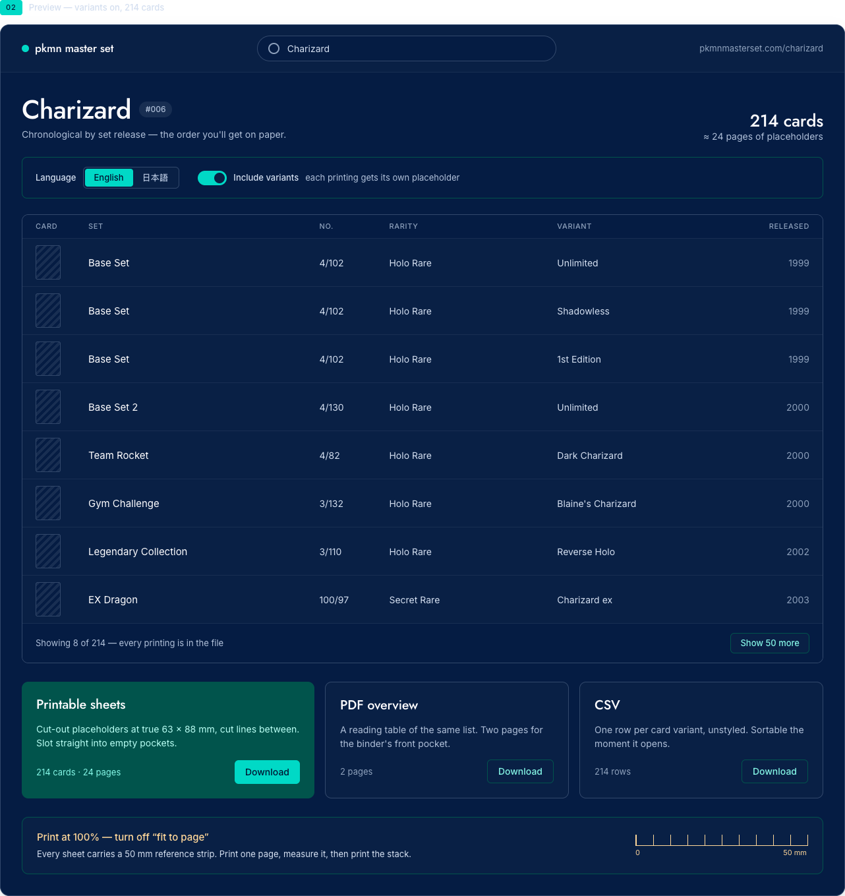
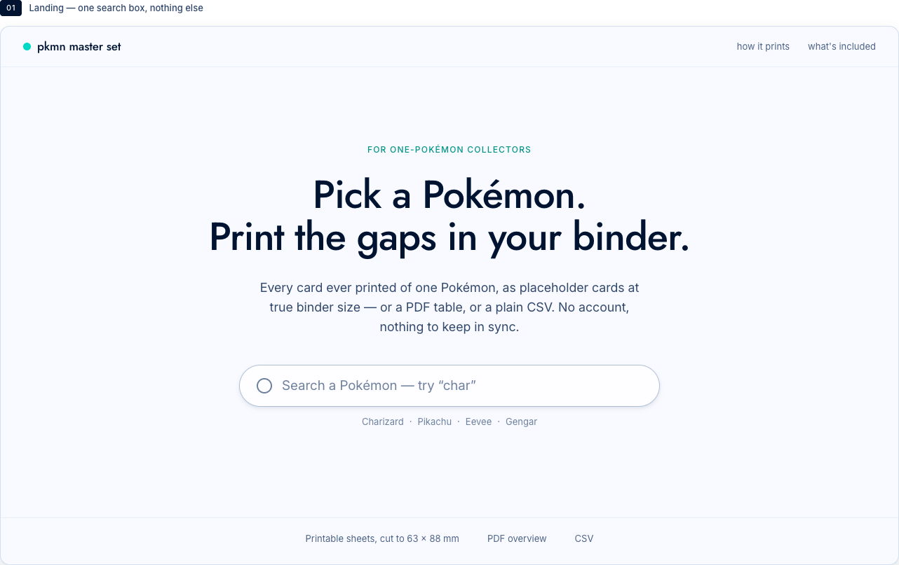
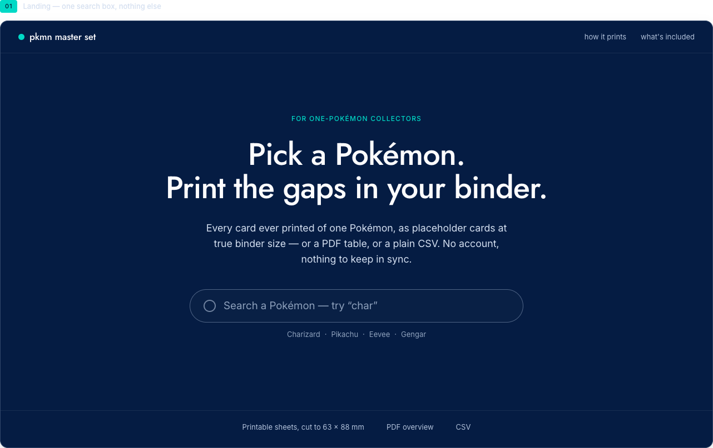
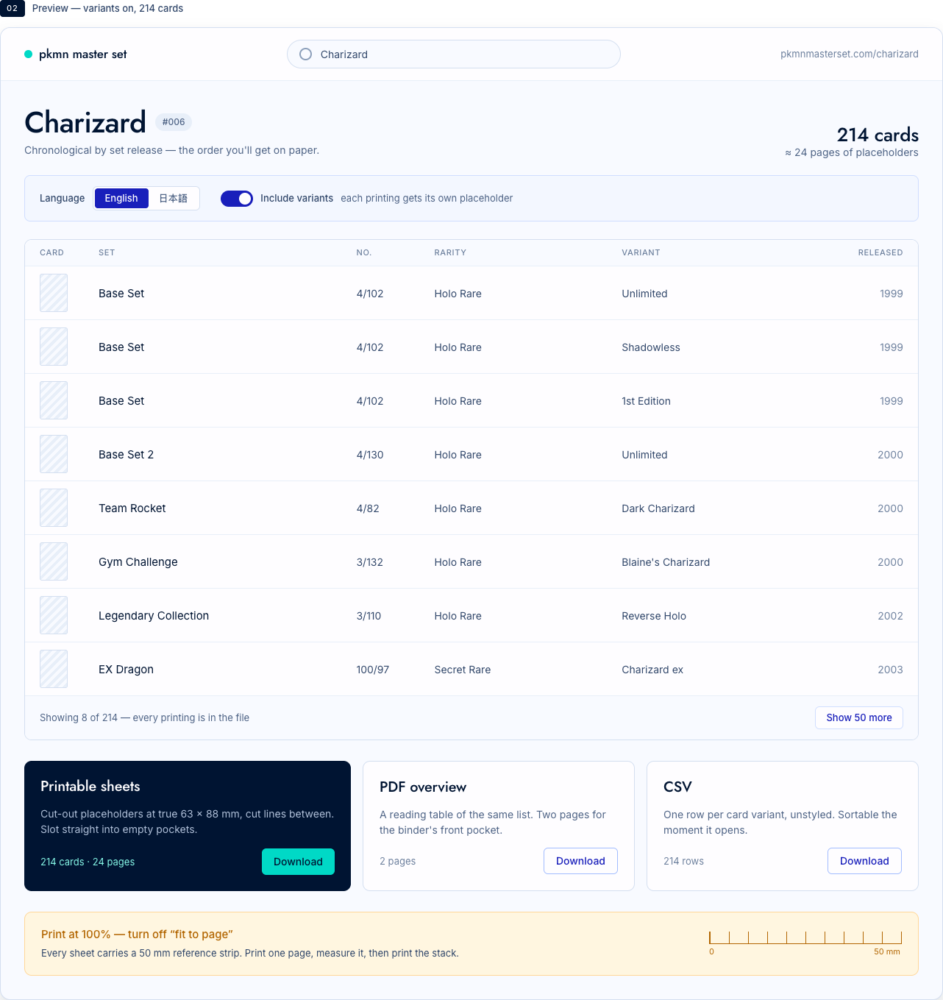
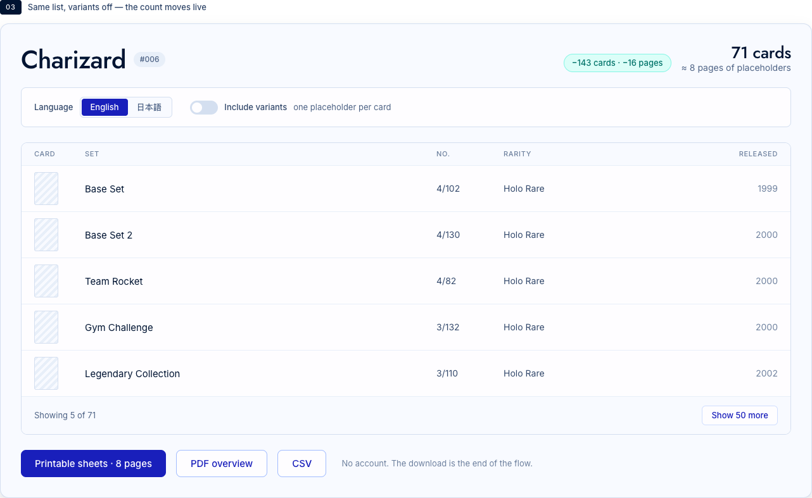

<div align="center">

# pkmn-master-set

**Pick a Pokémon, see every card of it that exists, download something you can print.**

[](https://go.dev)
[](https://htmx.org)
[](go.mod)
[](https://tcgdex.dev)
[](LICENSE)



</div>

---

Collectors chasing every card of a single Pokémon track their progress in a binder, on paper. What
they lack is the starting artifact: a complete, accurate, printable list of what exists.

```
 ┌──────────┐     ┌──────────────┐     ┌─────────────┐     ┌────────────┐
 │ Pick a   │  →  │ Preview the  │  →  │ Pick a      │  →  │ File       │
 │ Pokémon  │     │ card list    │     │ format      │     │ downloaded │
 └──────────┘     └──────────────┘     └─────────────┘     └────────────┘
```

No accounts, no digital ownership state, no syncing. The output goes to a printer or a spreadsheet
and the product's job is finished.

Go + htmx. The server renders full pages and HTML fragments with `html/template`; htmx swaps the
fragments into the page. **No Go module dependencies.**

## Quick start

```sh
go run .          # http://localhost:8080
ADDR=:3000 go run .
```

```sh
go test ./...                    # no network
go test -tags=live ./...         # hits the real card API
```

## Screenshots

<table>
<tr>
<td width="50%"></td>
<td width="50%"></td>
</tr>
<tr>
<td align="center"><em>Landing — one search box</em></td>
<td align="center"><em>…and in the dark</em></td>
</tr>
<tr>
<td></td>
<td></td>
</tr>
<tr>
<td align="center"><em>Every printing…</em></td>
<td align="center"><em>…or one row per card</em></td>
</tr>
</table>

## Layout

```
main.go                     entrypoint, catalog wiring, graceful shutdown
internal/cards/             the domain: cards, printings, variants, ordering, search
internal/tcgdex/            client for the card data API
internal/server/server.go   routes + handlers
cmd/species/                one-off generator for the National Dex index
cmd/sprites/                one-off downloader for the Dex sprites in the typeahead
web/embed.go                embeds templates and static assets into the binary
web/templates/layout.html   the page shell
web/templates/pages/        one file per full page, each defining "main"
web/templates/partials/     htmx fragments: preview panel, rows, suggestions
web/static/                 app.css, vendored htmx.min.js, 1,025 Dex sprites
docs/variant-taxonomy.md    what counts as a card and as a separate printing
docs/design/design.md       the screens this UI implements, light and dark
```

Each page is parsed into its own template set (`layout.html` + `partials/*` + that page), so every
page can define `main` without colliding with the others.

## Routes

| Route | What it is |
| --- | --- |
| `/` | Landing: one search box |
| `/search?q=` | Typeahead suggestions (fragment) |
| `/go?q=` | Resolves a submitted search box and redirects |
| `/{pokemon}` | The preview. `?lang=en\|ja&variants=1\|0`, and the shareable URL |
| `/rows/{pokemon}?offset=` | The next batch of rows (fragment) |
| `/download/{pokemon}/{sheets\|pdf\|csv}` | 501 until issues 003 and 004 land |

A Pokémon owns a bare URL (`/charizard`), which is why the fragment and download routes sit under
prefixes of their own rather than under the Pokémon.

An htmx request to `/{pokemon}` returns the preview panel alone, so toggling an option swaps the
counts, the list and the download sizes together — one answer, no chance of them disagreeing — while
the URL stays the shareable one.

## Card data

> [!IMPORTANT]
> The unit of this product is the **printing**, not the card: *Base Set Charizard 1st Edition* and
> *Base Set Charizard Unlimited* are two different things to find and two different binder slots.
> [`docs/variant-taxonomy.md`](docs/variant-taxonomy.md) states exactly what counts and what we
> deliberately exclude — read it before changing how printings are expanded.

Data comes from [TCGdex](https://tcgdex.dev), fetched live and cached in memory, so a newly released
set shows up without a redeploy.

<details>
<summary><strong>Why the REST API, and the sharp edges of it</strong></summary>

<br>

- Only the [REST API](https://tcgdex.dev/rest/cards) is used, for every language. TCGdex also has a
  GraphQL endpoint, but it is English-only — it ignores `Accept-Language` and there is no
  `/v2/ja/graphql` — so using it meant two code paths that had to agree about which cards exist. They
  return the same corpus, so the second one bought nothing but a place to drift.
- The list endpoints return a trimmed shape and REST has no field selection, so a Pokémon costs one
  list request plus one detail request per card, bounded at 16 in flight. Roughly a second for the
  largest list (Pikachu, ~200 cards), then cached.
- Cards are attributed by `dexId`, filtered with strict equality (`dexId=eq:6`). The API's default
  laxist filter matches as a *substring*, so a bare `dexId=6` would also return dex 16, 60 and 106.
- Unrecognised query parameters are treated as filters matching nothing, so a mistyped one returns
  `[]` rather than an error. Build query strings from checked constants.
- Set release dates are never returned alongside a card, so the set index is fetched separately and
  joined by set ID. `main.go` warms the English index at startup.

</details>

`PKMN_CACHE_TTL` (a Go duration, default `24h`) controls how long a fetched list is reused. Set
metadata never expires — a set's name and release date are fixed once it has shipped.

If a refresh fails but a cached copy exists, the cached copy is served. For this product a slightly
old complete list beats an error page.

<details>
<summary><strong>Regenerating the Pokémon index</strong></summary>

<br>

`internal/cards/data/species.json` maps National Dex numbers to names for the search box. It is
generated, committed, and embedded, so search works offline and instantly. Regenerate it when a new
generation of Pokémon is released:

```sh
go run ./cmd/species -out internal/cards/data/species.json
```

It reads PokéAPI at generation time only. The server never calls it.

</details>

<details>
<summary><strong>Regenerating the sprites</strong></summary>

<br>

The typeahead shows a sprite per suggestion, served from `web/static/sprites/{dexId}.png` and
embedded in the binary — the suggestion list must not depend on a third party being up. Rerun this
after regenerating the species index, which is where it reads the Dex numbers from:

```sh
go run ./cmd/sprites -out web/static/sprites
```

</details>

<details>
<summary><strong>Completeness checks</strong></summary>

<br>

`internal/cards/testdata/completeness/` holds hand-transcribed collector reference lists, checked by:

```sh
go test -tags=live -run TestCompleteness ./internal/cards/
```

See the README in that directory.

</details>

## Adding a feature

1. Add a handler in `internal/server/server.go` and register it in `Routes()`.
2. Add a page in `web/templates/pages/` (defining `main`, and listed in `pageFiles`) or a fragment in
   `web/templates/partials/` wrapped in `{{define "name"}}...{{end}}`.
3. Point an element at it with `hx-get` plus `hx-target`.

> [!NOTE]
> Templates and static assets are embedded, so restart the server to pick up edits.

htmx is vendored at `web/static/js/htmx.min.js` (v2.0.4) — no CDN at runtime. The one exception is
the webfonts, Jost and Inter, loaded from Google Fonts with system-font fallbacks so a blocked CDN
degrades rather than breaks.

## License

[MIT](LICENSE)
